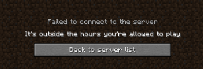
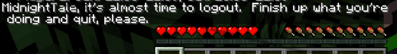
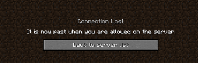
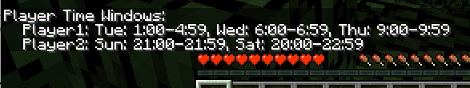

Source code for Bukkit plugin https://dev.bukkit.org/projects/player-time-window

# Config File

Rules:
1. If a player is not listed in `schedules`, or is listed in `schedules`
with no entries, they can login anytime.
1. If a player is in "schedules", their day-of-the-week entries
list the times they can login ("opt-in" semantics):
   1. If they have no entry for a day of the week, they cannot login at all
      on that day of the week.
   1. If a day of the week isn't `all` it is parsed as a whitespace-separated
      list of hour ranges using a 24-hour clock.  Each entry is the lower-bound
      hour, a hyphen ("`-`") and the upper-bound hour. The player can login as
      long as the current time is within any of the time ranges.

As a special case, `0-24` means "anytime".

Examples:

```yaml
schedules:
    Player1:
    Player2:
       Sat: 0-24
       Sun: 0-24
    Player3:
       Mon: 9-11 17-21
       Wed: 9-11 17-21
       Fri: 9-11
```

Interpretation:

* `Player0` isn't listed and can login anytime on any day.
* `Player1` **is** listed but has no days of the week.  They can login anytime.
* `Player2` can login anytime on Saturday and Sunday only (no weekdays).
* `Player3` can login Monday between 9 and 11 and also between 17 and 21
  *(9 AM to 11 AM and 5 PM to 9 PM)*.


# User Experience

PlayerTimeWindows interacts with players by sending them individual messages,
sending broadcast messages to everyone, and forcefully disconnecting users
when outside their open time windows.


## Connecting to Minecraft

When a user is within a time range they can play, they can login to the game
and play normally.  PlayerTimeWindows doesn't alter the game play.

If a player tries to connect when outside a time window, the server will not
let them join and display an informative message for them:




## Overstaying Your Welcome

When a user is playing Minecraft and their time window closes, they will see
a warning message delivered (only) to them warning them that they are about
to be disconnected.

If they are still connected after roughly 5 minutes, they will be forcefully
disconnected from the game.  They will not be able to reconnect until the next
time window opens for them, either later in the current day or on the next day
they have an open window.

Warning message seen while playing:



This is broadcast to all players, and is shown on the server console:

```
[16:59:52 INFO]: MightyBacon, it's almost time to logout.  Finish up what you're doing and quit, please.
```

Message when forcefully disconnected:



What you see on the console:

```
[17:05:01 INFO]: MightyBacon left the game because it's past their allowed time
```


# Commands

All commands can be executed from the server console or by a player.  Some
require specific permissions to execute.

All commands start with "`/timewindows`".

As usual, all commands executed by players are logged on the console for auditing:

```
[16:55:52 INFO]: MightyBacon issued server command: /timewindows list
```


## List

`/timewindows` or `/timewindows list`

List each player with a time window from the config file.  This displays all users' time windows.



```
>timewindows list
[16:36:13 INFO]: Player Time Windows:
[16:36:13 INFO]:    Player1: Tue: 1:00-4:59, Wed: 6:00-6:59, Thu: 9:00-9:59
[16:36:13 INFO]:    Player2: Sun: 21:00-21:59, Sat: 20:00-22:59
```


## Status

`/timewindows status`

```
>timewindows status
[16:39:32 INFO]: Player time windows are currently disabled
```

Display a one-line status saying if the plugin is enabled or disabled.  When disabled, all time windows are ignored and all players may connect and play indefinitely.


## Enable / Disable

* "`/timewindows enable`": turn on the plugin and enforce all time windows
* "`/timewindows disable 5`": turn it all off and allow all players to login *(or all whitelisted users if you're using a whitelist)*

When enabled all time windows are in effect and the plugin will deny players
who are outside their time window.

Disable the plugin for the number of hours specified.  The number of hours has
to be positive.  You cannot disable the plugin indefinitely.


**Example:**

The plugin is enabled by default and will enforce time windows:

```
>timewindows enable
[16:36:20 INFO]: Player time windows are already enabled.
```

Turn it off.  All time windows are put on hold and all players can login:

```
>timewindows disable 4
[16:36:27 INFO]: Player time windows disabled for 4 hours.
```

When enabled a player cannot login outside of their time windows:

```
>timewindows enable
[16:36:39 INFO]: Player time windows are now being enforced.
[16:38:30 INFO]: MightyBacon tried to login outside of their allowed hours
```

When disabled, anyone can login normally:

```
>timewindows disable 3
[16:39:12 INFO]: Player time windows disabled for 3 hours.
[16:39:17 INFO]: UUID of player MightyBacon is 8f61f44e-f13e-454e-98f0-6bf39cf6b2c6
[16:39:17 INFO]: MightyBacon[/127.0.0.1:57852] logged in with entity id 256 at ([world]262.5, 87.0, 287.5)
```


# TO DO

1. Allow minutes instead of just hour ranges in config file
1. Localize messages
